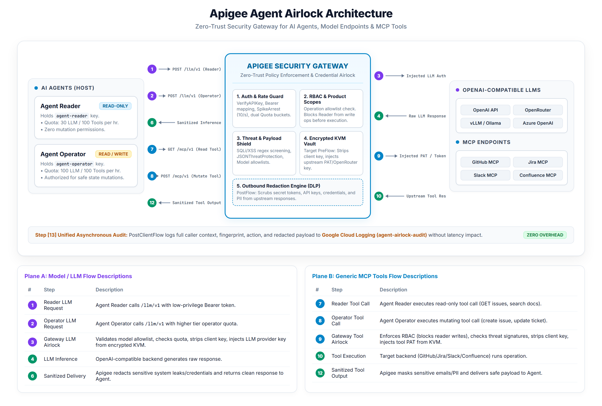
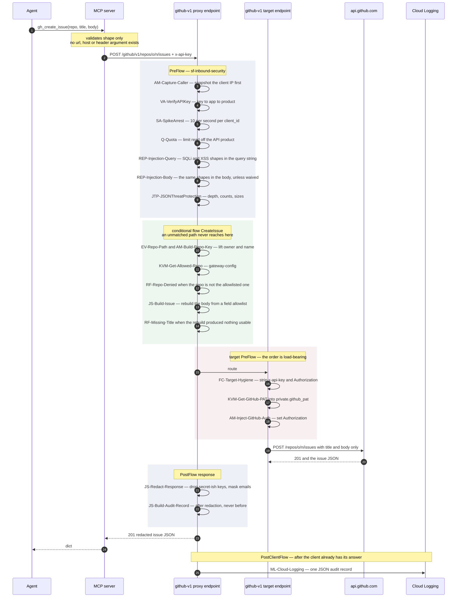
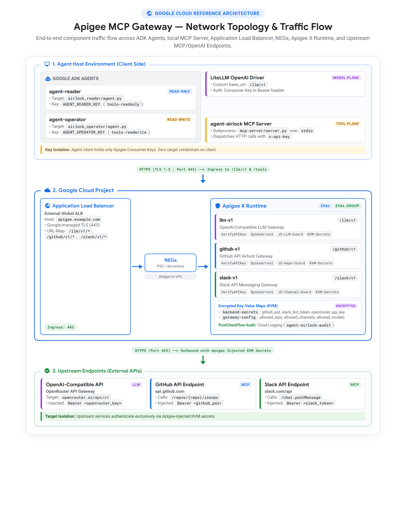
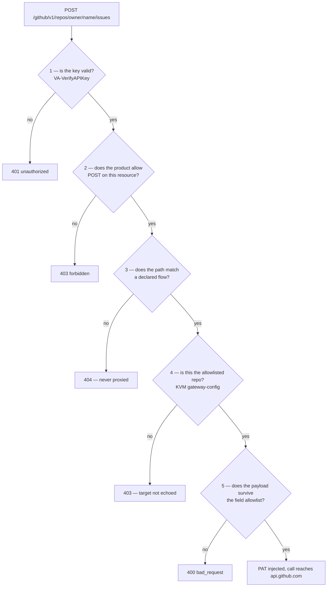

# Architecture — Agent Airlock

How an LLM agent reaches a real backend without ever holding a real credential.

The short version: the agent talks to a local MCP server, the MCP server talks to
Apigee, and only Apigee talks to GitHub. Each hop strips something away. The
agent can express far less than the MCP server can express, the MCP server can
express far less than the gateway will accept, and the gateway will accept far
less than GitHub would. That narrowing is the security property; everything
below is how it is enforced.

The same argument is then applied to the model. An agent normally holds its
provider key directly, which puts a credential that can spend money inside the
process most exposed to injected instructions, and leaves the audit log blank
in exactly the place the reasoning happened. So the model is treated as one more
backend behind the same airlock: the agent's LLM client points at `/llm/v1` and
presents the same consumer key it uses for tools, and the OpenRouter key enters
the request inside the target endpoint, out of the same encrypted KVM as the
PAT. One identity, two planes, one log — which is what makes a session
reconstructable rather than a set of unrelated calls that happened nearby.

---

## 1. Traffic flow



Left to right: an agent identity that holds nothing but a consumer key, the five
stages every request passes through, and the backends — each reached with a
credential the agent never saw. The backend tiles are drawn as the general shape
of the pattern; this deployment implements four proxies against real upstreams —
`weather-v1` → open-meteo, `github-v1` → `api.github.com`, `slack-v1` →
`slack.com/api`, and `llm-v1` → `openrouter.ai/api/v1`.

Steps 3 and 9 are the whole design in two arrows. The agent's key stops at
Apigee — it is removed from the request before any upstream call is made, and it
is not a credential anywhere else in the world. The PAT, the bot token and the
OpenRouter key *start* at Apigee — each enters the request inside its target
endpoint, microseconds before the socket opens, out of an encrypted KVM that the
agent has no path to.

The inbound steps are worth reading as one. Model calls (1, 2) and tool calls
(7, 8) leave the host by different libraries and arrive on different basepaths,
but they carry the same consumer key, so `llm.chat` records and
`weather.forecast` records land in the audit under the same `agent` and the same
`client_key_fp`. The model plane
also accepts that key as a `Bearer` token rather than an `x-api-key` header —
not a second credential, a translation. OpenAI-compatible clients have no way to
send anything else, and `AM-Bearer-To-ApiKey` copies it into `x-api-key` before
`VA-VerifyAPIKey` runs, so one identity survives a transport that was designed
around provider keys.

Step 13 has a tail the picture stops short of. The audit log feeds two log-based
metrics, two alert policies, and one Slack notification channel — and that last
hop deliberately does not run through `slack-v1`. Google's Monitoring
integration posts with its own OAuth-minted credential to `#ai-gateway-alerts`,
a channel the gateway is not allowlisted for. So the alarm that fires when this
gateway is being abused does not depend on the gateway still working, and an
operator reading the alert channel is reading something the agent plane has no
way to write to. Section 4.6 has the metrics and thresholds.

---

## 2. What one request actually executes

A successful `gh_create_issue` from the operator identity, policy by policy:



Two ordering decisions there are not cosmetic.

**Hygiene runs before injection.** `FC-Target-Hygiene` removes `x-api-key`,
`apikey`, `Authorization` and `Proxy-Authorization` from the outbound request,
and only then is the PAT read and set. Swap those two steps and the gateway
deletes the header it has just written. The same ordering is what stops a caller
smuggling its own `Authorization` upstream, or shadowing the one the gateway is
about to add.

**The audit is built after redaction.** The record is assembled from a response
that has already been scrubbed, so an audit entry can never describe a body the
caller was not permitted to see. That keeps "no secrets in the logs" true by
construction instead of by hoping the redaction pass caught everything.

---

## 3. How the gateway is set up

Section 1 is the trust boundary. This is the wire it runs on:



Every hop is HTTPS on 443, and the only inbound path to Apigee is through the
External ALB — a serverless NEG bridges it into the Apigee VPC, so the runtime
has no public address of its own and nothing bypasses the URL map. The host
column shows both planes leaving the agent host: the MCP server over `stdio`
locally, then HTTPS with `x-api-key`; LiteLLM straight to `/llm/v1` with the
same key as a `Bearer` token. The diagram uses `apigee.example.com` as the
ingress hostname; this deployment answers on `YOUR_LB_IP.nip.io`, for the
reason in the first row of the table below.

| Component | Name | Purpose |
| --- | --- | --- |
| Ingress | External ALB at `YOUR_LB_IP.nip.io` | Managed TLS; `nip.io` supplies a resolvable hostname for a certificate without owning a domain |
| Environment | `eval`, in envgroup `eval-group` | The single Apigee X eval environment |
| Proxy | `weather-v1` — `/weather/v1` | Unauthenticated public backend; proves the policy chain with no credential in play |
| Proxy | `github-v1` — `/github/v1` | The credential-injecting proxy; the interesting one |
| Proxy | `slack-v1` — `/slack/v1` | The second credential-injecting proxy; a channel allowlist and a message rewriter, because a bot token is scoped by capability rather than by resource |
| Proxy | `llm-v1` — `/llm/v1` | The model plane: OpenAI-compatible, model allowlist, token ceiling, its own quota |
| Shared flow | `sf-inbound-security` | Caller capture, key verification, spike arrest, quota, injection screening, JSON threat protection |
| Shared flow | `sf-target-hygiene` | Strips client credentials before any upstream call |
| Shared flow | `sf-outbound-redaction` | `JS-Redact-Response` on every response, upstream or locally generated |
| Shared flow | `sf-fault-sanitizer` | Maps every fault to a fixed `{"error","message"}` body |
| Shared flow | `sf-audit-build` | Assembles the audit record, and recovers the identity on a scope refusal |
| Shared flow | `sf-audit-log` | The `MessageLogging` write, and nothing else |
| KVM | `backend-secrets` — encrypted | `github_pat`, `slack_bot_token` and `openrouter_api_key`, the only copies of any of the three |
| KVM | `gateway-config` | `github_allowed_repo`, one `slack_channel_<ID>` per permitted channel, `llm_allowed_models`, `llm_max_tokens` — where each credential may be spent, and how much of it |
| Service account | `apigee-airlock-logger@…` | Holds `roles/logging.logWriter` and nothing else |

Shared flows rather than per-proxy copies, because two bundles carrying "the
same" security chain drift apart. A third proxy inherits the identical chain in
the identical order by calling one `FlowCallout`.

### Identities

Identity is an API key bound to a developer app, bound to an API Product — and
the product is where the operation allowlist lives.

| App | Product | May call | Quota | Model quota |
| --- | --- | --- | --- | --- |
| `agent-reader` | `tools-readonly` | `GET /forecast`, `GET /repos/*/*/issues`, `GET /conversations.history`, `GET /auth.test`, `POST /chat/completions`, `GET /models` | 100 / hour | 30 / hour |
| `agent-operator` | `tools-operator` | the above, plus `GET /archive`, `GET`+`POST /selftest`, `POST /repos/*/*/issues`, `POST /chat.postMessage` | 100 / hour | 100 / hour |
| — | `tools-quotaprobe` | `GET /forecast` | 10 / hour | none — cannot call a model at all |

Read and write are different identities holding different keys. An agent that
only ever needs to read runs with the reader key, and no prompt, no tool
description and no injected instruction can turn that key into one that may
POST: the refusal happens inside Apigee, before the proxy's own logic runs, on a
fact about the credential rather than about the request.

Slack is where that product list stops being bookkeeping and starts being the
control. GitHub's PAT can at least be minted against one repository, so the
product and the token agree about the blast radius. Slack's bot token cannot:
its scopes are verbs, not places, and the Web API presents them as one flat
namespace of a couple of hundred methods — `conversations.list`, `users.list`,
`files.upload`, `chat.delete`, `admin.*` — all reachable with the same header.
Three operations are declared for `slack-v1` across the two products, and
`RF-Unknown-Resource` handles the rest of that namespace. Which is to say the
product is not describing what the credential can do; it is the only thing
narrowing it.

The model plane is scoped on the same terms, and this is what makes it a plane
rather than a proxy that happens to be deployed nearby. `/chat/completions` is
an operation on a product like any other, so an identity that was never granted
it gets a 403 from `VerifyAPIKey` — `tools-quotaprobe` cannot spend the
gateway's OpenRouter key, and did not have to be told so anywhere in `llm-v1`.

The two quota columns are separate counters, not one budget spent twice. Apigee
scopes a quota counter per policy, so `Q-LLM-Quota` in `llm-v1` does not share
`Q-Quota`'s bucket even though both key on `client_id`: an agent that exhausts
its thinking budget can still look up the weather, and an agent looping on a
tool cannot quietly consume the money. The limit itself is a product attribute
(`llm_quota`), read at runtime by `countRef`, so the reader's 30 and the
operator's 100 are a property of the role and change without a redeploy.

`tools-quotaprobe` exists so throttling can be demonstrated in seconds without
spending the real identities' budget.

### The agents themselves

`adk-agents/` holds two Google ADK agents that use both planes at once, and they
are the reason the model plane exists in this shape. `airlock_reader` and
`airlock_operator` are ten lines each; everything is in a shared factory, and
they differ only in which consumer key they present. Neither holds a provider
credential, and both refuse to start if one is found in the environment — the
same contract `mcp-server/server.py` enforces, extended to the model-plane names.
See [adk-agents/README.md](adk-agents/README.md), which also documents a subtler
leak: LiteLLM loads the repository's `.env` on import unless told not to, which
would hand an agent the very keys the launcher had just stripped.

---

## 4. How this secures MCP

MCP's exposure is specific. The transport is trusted, the client is a language
model, and tool arguments are model-generated text that can be steered by
anything the model has read — an issue body, a web page, a file it was asked to
summarize. The controls below are arranged around that.

### 4.1 The agent holds no backend credential

The MCP server's environment contains `APIGEE_HOST` and `AGENT_API_KEY`. That is
the complete list. There is no GitHub token in the process, so there is nothing
for a prompt injection, a stack trace, a debug log or a compromised dependency
to exfiltrate. What the process does hold is a key that is meaningless anywhere
except this gateway, scoped to a handful of operations, rate limited, fully
audited, and revocable in one API call without touching the PAT.

The server refuses to start if `GITHUB_TOKEN`, `GITHUB_PAT`, `GH_TOKEN`,
`HA_TOKEN`, `HOME_ASSISTANT_TOKEN`, `OPENWEATHER_API_KEY`, `SLACK_BOT_TOKEN`,
`SLACK_TOKEN`, `SLACK_APP_TOKEN`, `SLACK_USER_TOKEN` or `SLACK_WEBHOOK_URL` is
present. Someone debugging a failure by exporting a token gets a crash instead of
a working bypass, which is the right trade: a bypass that works is worse than one
that is loud.

`SLACK_WEBHOOK_URL` is on that list even though it is not a token, and it is the
entry most likely to be argued with. An incoming-webhook URL is a bearer
capability in URL clothing: anyone holding the string can post to a channel with
no credential and no gateway in the path. It is also the most casually shared of
Slack's secrets — pasted into CI config, into a README, into a chat message —
which makes "it is only a URL" precisely the reasoning that puts it in an agent's
environment.

Slack is also why the credential list is longer than the backend count suggests.
A GitHub PAT has one name; Slack ships bot tokens, user tokens, app-level tokens
and webhooks, each a different bypass with a different conventional variable
name. Enumerating them is not thoroughness for its own sake — a check that covers
`SLACK_BOT_TOKEN` and misses `SLACK_USER_TOKEN` is a check that reports a clean
environment while a broader credential than the gateway's own sits next to it.

The ADK agents enforce the same contract over a longer list, adding
`OPENROUTER_API_KEY`, `OPENAI_API_KEY`, `OPENAI_API_BASE` and
`ANTHROPIC_API_KEY`. `OPENAI_API_KEY` is the sharpest of those, because LiteLLM
reads it from the environment unprompted: a key left in a shell would be picked
up silently and every model call would leave through the front door — no
allowlist, no ceiling, no quota, no audit record, and a dashboard showing a quiet
day. The agents also filter the environment a second time, on the way into the
MCP subprocess. The child would refuse on its own, but a subprocess that dies at
spawn reaches the model as "the tools are broken", which is a worse thing to
debug than a clean environment.

### 4.2 The agent cannot express a destination

No tool takes a `url`, a `host`, a `base_url` or a `headers` argument. The base
URL is built once at startup from a value that must be a bare hostname — a
scheme or a slash in `APIGEE_HOST` aborts the process — and every tool goes
through a single `_call()` choke point. There is no argument an agent can fill
in that redirects a request somewhere else, which removes SSRF-by-tool-argument
as a category rather than filtering for it case by case.

The agents build their model base URL from the same value under the same rule,
and refuse a scheme or a path in `APIGEE_HOST` for the same reason. Config is an
attack surface too: a path accepted there would redirect every model call and
every tool call at once — the exact thing this architecture exists to prevent,
arriving through a config file rather than through a prompt.

### 4.3 Five independent gates on the GitHub write path



They answer different questions, and none of them substitutes for another:

1. **Who is this.** The key resolves to an app, or it does not.
2. **What may this identity do.** The API Product decides verbs and resources.
   The reader cannot POST anywhere, at all.
3. **What shape of request exists.** Both proxies declare their flows and end
   with `RF-Unknown-Resource`. An undeclared path is rejected, not forwarded —
   the gateway is an allowlist of operations, not a reverse proxy that happens
   to have some rules bolted on.
4. **Where may the credential be spent.** The repository allowlist lives in a
   KVM and is compared literally against the two path segments lifted out of the
   request. The PAT may be perfectly valid for two hundred repositories; the
   gateway will spend it on exactly one. The refusal does not echo the repo the
   caller asked for, so the response cannot be used to probe what is allowed.
5. **What may the payload contain.** `JS-Build-Issue` does not sanitize the
   incoming body — it *discards* it and rebuilds one from `title` and `body`.
   `assignees`, `labels`, `milestone`, and anything GitHub invents later, cannot
   reach the API because they are never copied. An agent cannot notify, tag or
   assign a human being. A denylist of known-bad fields would need updating
   every time the upstream API grows one; rebuilding from an allowlist does not.

Gate 4 is also the fail-closed one. With `gateway-config/github_allowed_repo`
absent, `gh.allowed_repo` is null, no repository can equal null, and every
GitHub call is denied. A missing configuration closes the gateway rather than
opening it — asserted in the suite, not assumed.

**The same five gates run on the Slack write path**, with two differences worth
stating because they are where Slack is harder than GitHub.

Gate 4 cannot be one KVM entry. Apigee conditions have no list-membership
operator, so a comma-joined `slack_allowed_channels` could only ever be compared
with `=` — correct for a one-channel allowlist and silently denying for every
channel after the first. So the allowlist is one entry per channel,
`slack_channel_<ID>`, and the proxy builds the key from the requested channel
(`AM-Build-Channel-Key`, because conditions cannot concatenate strings either)
and asks whether it exists. Fail-closed falls out of the same null comparison as
GitHub's: an unprovisioned channel yields a null and nothing equals null.

Gate 5 has to reach into the text, which the GitHub equivalent does not.
`JS-Build-Message` discards the body and rebuilds `{channel, text}`, which drops
`blocks` and `attachments` (interactive elements posted into a channel) and
`username` and `icon_emoji` (posting as somebody else) on the same allowlist
principle as `assignees`. But Slack's most consequential capability lives *inside*
the message text: `<!channel>`, `<!here>`, `<@U…>` and `<!subteam^…>` page real
people, and there is no field to strip because there is no field. So the text is
rewritten in place — `<!channel>` becomes the literal `@channel`, which reads the
same to a human and notifies nobody. An agent can say it is paging the team; it
cannot page the team.

There is also a gate the GitHub path does not need at all, because GitHub does
not do this: **Slack refuses with HTTP 200.** `missing_scope`, `not_in_channel`,
`channel_not_found` all arrive as `200 {"ok":false,"error":…}`. Taken at face
value the audit would record `outcome: ok` for a call that did nothing, the
write-attempt metric would undercount every refusal, and the agent would report a
message it never sent. `JS-Slack-Outcome` reads the body and rewrites the status
before either the caller or the audit sees it — mapping permission errors to 403,
bad-token errors to 502 rather than 401 (a 401 would tell the agent its own key
was rejected and send an operator hunting through Apigee for a fault that lives
in the KVM), rate limits to 429, Slack-side faults to 502, and anything
unrecognised to 400. Slack's own error string is kept for the audit and stripped
from the response, because `channel_not_found` versus `not_in_channel` tells a
caller whether a channel it guessed at exists — the enumeration gate 4 exists to
prevent, arriving through the error body.

### 4.4 Availability and blast radius

`SA-SpikeArrest` caps bursts at 10 per second per `client_id`. `Q-Quota` reads
its limit, interval and unit off the API Product at runtime, so changing a plan
is a product edit rather than a proxy redeploy. Both key on `client_id`, so a
looping or compromised agent throttles itself and not its neighbours — and both
run *after* `VerifyAPIKey`, because `client_id` does not exist before it.

`REP-Injection-Query` and `REP-Injection-Body` screen the query string and the
body for SQLi and XSS shapes. `JTP-JSONThreatProtection` bounds container depth,
entry counts, name lengths and string sizes, and is skipped on GET, which
carries no body.

They are two policies rather than one because the model plane needs the query
screen and cannot take the body screen. A chat prompt is natural language, and
"explain what `UNION SELECT` does" is a legitimate question — screening a prompt
for SQL shapes rejects the use of the model, not an attack on it. So `llm-v1`
sets `inbound.skip_body_screen=true` in `AM-Inbound-Flags`, and the shared flow
runs `REP-Injection-Body` only when that flag is absent. The query string is
still screened, because nothing legitimate on `/llm/v1` puts a payload there.

`llm-v1` opts out of the shared JSON threat protection on the same reasoning and
substitutes its own. The shared `JTP-JSONThreatProtection` caps a string at 8192
bytes, which is a sensible bound on a GitHub issue title and far too small for a
conversation; `inbound.jtp=custom` suppresses it and `JTP-LLM` applies limits
sized for a chat body. Suppressed and replaced, not simply suppressed — an opt
-out that left the plane unscreened would be a hole with a comment in front of
it.

The flags are set in `llm-v1`'s own PreFlow *before* `FC-Inbound-Security` is
called, which is the only order that works: the shared flow reads variables it
does not set, so a proxy that declares nothing gets the strict defaults. Opting
out is something a proxy must do deliberately, and silence means screened.

### 4.5 Nothing chatty comes back

Every fault leaves through `sf-fault-sanitizer` and becomes a fixed
`{"error","message"}` body. Apigee's native fault text names policies, revisions
and internals; none of it reaches the caller. The classification lives in one
shared flow whose conditions are deliberately **mutually exclusive**, rather
than relying on Apigee's bottom-up first-match fault ordering — so reordering
the steps cannot change a status code.

Every response passes `JS-Redact-Response`, which drops any key matching
token / secret / password / api_key / authorization and masks email addresses to
`f***@domain`. It runs on locally generated responses too, so a fault body is
scrubbed on the same terms as a 200 from GitHub.

The observability plane is covered on the same terms. `AE-Resolve-App` returns
the whole app entity, consumer secrets included, so the environment's debug mask
hides `AccessEntity.AE-Resolve-App`; otherwise anyone able to start a trace
could read the very credentials this gateway exists to keep out of reach. The
mask is applied by `provision.sh` before the proxy that needs it is deployed,
and a static check keeps it there.

### 4.6 Every attempt is accountable

One JSON record per request, to `projects/<org>/logs/agent-airlock-audit`:

```json
{
  "ts": "2026-08-23T03:07:41Z", "agent": "agent-reader", "client_key_fp": "4ddfa347",
  "proxy": "github-v1", "revision": "3", "verb": "POST",
  "path": "/repos/owner/name/issues", "action": "github.issues.create",
  "status": 403, "outcome": "denied", "fault": "InvalidApiKeyForGivenResource",
  "latency_ms": 118, "target_latency_ms": null, "client_ip": "203.0.113.9",
  "repo": "owner/name", "detail": "the issue title, truncated to 120 chars"
}
```

- **Refusals are recorded exactly like successes.** The question an audit exists
  to answer is *what did the compromised agent try to do*, and a log of only the
  calls that worked cannot answer it. The record is built in `PostFlow/Response`
  **and** in both fault rules, because a refusal short-circuits straight past
  `PostFlow`.
- **The write cannot be skipped.** `ML-Cloud-Logging` sits in `PostClientFlow`,
  the one hook that runs unconditionally once the response has reached the
  client — so the audit costs the caller no latency, and no early exit dodges
  it. Build and write are separate shared flows because `PostClientFlow`
  executes `MessageLogging` policies **and nothing else**: a JavaScript step
  placed there is reported in a trace as having succeeded while setting no
  variables at all.
- **A scope refusal still names the agent.** Apigee raises
  `InvalidApiKeyForGivenResource` inside `VerifyAPIKey` and publishes no
  identity variable, so the single most interesting record used to land as
  `unauthenticated`. `AE-Resolve-App` looks the app up from the consumer key,
  independently of `VerifyAPIKey`, and only when nothing else has produced a
  name. It resolves the *credential*, not the authorization: `agent` says which
  key was presented, and `outcome` still says `denied`.
- **No credential is logged in usable form.** The caller's key appears only as
  an eight-character fingerprint — enough to correlate a repeated bad key across
  records, which is the shape of someone guessing, and useless to whoever reads
  the log.
- **`AM-Capture-Caller` runs first in the chain**, before the key is even
  checked, because the client address is destroyed later in the request and must
  be recorded even for a caller that never obtains an identity.

From there, a log-based metric counts issue-creation attempts per agent per
outcome — refusals included — and an alert policy fires above 20 per agent per
hour. A prompt-injected agent retrying a denied write against policy looks
exactly like that, and it becomes visible without anything having succeeded.

Both this policy and the token-spend one below deliver to every notification
channel named in `ALERT_CHANNEL_TITLES`, which defaults to the single channel
`ai-gateway-alerts` — because an alert nobody reads for six hours is a log entry
with extra steps. That string is the channel's *Monitoring display name*, not
the Slack channel name it happens to match; renaming either one in the console
unwires the alarms, so `monitoring.sh` prints what it could not resolve instead
of skipping it quietly.

`monitoring.sh` looks channels up and never creates one. Not because it cannot:
the Monitoring API will build a Slack channel from a bot token, forwarding it to
Slack's `auth.test` and returning Slack's own verdict. Creation is withheld
because the token that would go in it is the same bot token the gateway injects
from the KVM, and copying a credential into a second system doubles both the
blast radius and the number of places a rotation has to reach. The console's
*Add Slack channel* flow mints a token belonging to Google's own Slack app
instead — a credential this project never holds. So the alert path is Google's
bot posting to Slack, not the gateway's, and it deliberately does not run
through `slack-v1`. An alarm wired through the thing it is watching goes quiet at
exactly the moment it matters — a revoked bot token, an exhausted quota, a
misprovisioned channel allowlist would each silence the alert about themselves.

### 4.7 The model is a backend too

Everything above treats the tools as the dangerous surface and the model as the
thing being protected from them. That is half the picture. The model call is
itself a request to a third party, paid for with a credential, carrying the
user's text — and in the usual arrangement it is the *only* call an agent makes
that nothing supervises.

`llm-v1` is an OpenAI-compatible endpoint, so any client that can be pointed at
a base URL works unmodified. What it will accept is narrower than what
OpenRouter would:

1. **The caller may decide the conversation; the gateway decides the routing.**
   `JS-LLM-Guard` deletes `provider`, `models`, `route` and `transforms` from the
   body. Each of those re-routes or re-prices the request: `models` is a fallback
   *array* — a second, unscreened model list that would bypass the allowlist the
   moment the first model errored — and `transforms` rewrites the prompt
   server-side, which makes the audit record a description of something that was
   not sent. Unlike `JS-Build-Issue` this is a denylist, deliberately: a chat body
   legitimately carries `tools`, `response_format`, `seed` and vendor extensions
   this gateway has no opinion about, and rebuilding from an allowlist would
   break real clients to guard fields nobody is attacking.
2. **The model must be on the allowlist**, held in `gateway-config/llm_allowed_models`.
   An unset or empty entry denies every model — the same fail-closed stance as
   the repo allowlist, and for the same reason: a gateway that has not been told
   what it may spend money on may spend none.
3. **`max_tokens` is clamped, and inserted when omitted.** Leaving the field out
   is how an unbounded request gets made, so absence is treated as "the ceiling",
   not as "no ceiling". The ceiling is the one value here that fails *open* to a
   built-in default: a missing ceiling costs money, while a missing allowlist
   would grant access to a model nobody approved, and those are not the same
   blast radius.
4. **Streaming is refused, not quietly degraded.** Apigee cannot run response
   policies over an SSE stream, so a streamed completion would disable outbound
   redaction, usage extraction, and the status and latency fields of the audit
   record all at once. A response path that looks armed and is not is worse than
   a 400 that says so.
5. **Undeclared resources are never proxied.** This matters more here than on
   the tool proxies: OpenRouter's own API surface includes credit balance, key
   management and generation history. `/chat/completions` and `GET /models` are
   declared; everything else meets `RF-Unknown-Resource`.

The target endpoint mirrors `github-v1` exactly — `FC-Target-Hygiene` strips the
caller's credentials, `KVM-Get-OpenRouter-Key` reads the key into a `private.*`
variable, `AM-Inject-OpenRouter-Auth` sets the header, in that order. It adds one
thing the tool proxies do not need: `success.codes` is widened to include 4xx and
5xx. Apigee treats any status outside 1xx–3xx as a target *error* and skips the
response flow entirely, which means the upstream's own error body — account
state, credit information, whatever OpenRouter chose to say — would travel back
to the caller untouched. Widening the definition of success is what lets the
gateway take responsibility for the failure instead of forwarding someone else's
account details along with it.

**The audit records the spend, never the prompt.** `EV-LLM-Usage` extracts the
model actually served and the token totals from the upstream response;
`llm.requested_model` and `llm.effective_max_tokens` come from the guard. The
messages are never captured. A refused request records the model that was asked
for — truncated to 120 characters, because it is caller-supplied text that by
definition did not pass the allowlist — since the point of alerting on refused
model requests is to see *which* model an agent kept reaching for.

Spend is watched by a second metric, `airlock_llm_tokens`, and it is the only
metric here whose value is not 1: a `valueExtractor` pulls `tokens_total` out of
the record, so summing the series gives tokens rather than calls. That
distinction is the whole point — ten one-word questions and one enormous
document summary are the same call count and nothing like the same bill. Cloud
Logging permits a value extractor only on a `DISTRIBUTION` metric, which forces
the alert to be written in MQL rather than as a plain threshold, since a
distribution cannot be compared to a number directly. The policy sums per agent
over a rolling hour and fires above 2000 tokens.

**Refusals get a metric of their own.** `airlock_denied_actions` is filtered on
`jsonPayload.outcome!="ok"` — a negation rather than a list of the interesting
verdicts, so a verdict added to `outcomeFor` later is counted rather than
silently missed, which is the failure mode that leaves a metric looking healthy
because it has gone blind. It carries the `fault` label, naming the policy that
did the refusing, and that is the difference between knowing an agent was denied
and knowing it was denied *by the repo allowlist*. The policy on it thresholds
at zero over five minutes, because one forbidden action is the whole event: a
rate here would read as coverage while hiding the single most interesting thing
this system can produce. Its second condition is volumetric and covers the other
half — a burst of 401s or 4xx from one identity, which is what credential
guessing looks like from the gateway's side.

---

## 5. Threat model in one table

| Threat | What stops it |
| --- | --- |
| Injection tells the agent to exfiltrate the GitHub token | The token is in neither the agent nor the MCP server; it exists only in an encrypted KVM read inside the target endpoint |
| Injection tells the agent to call an attacker's URL | No tool accepts a URL, host or header; the base URL is fixed at startup and must be a bare hostname |
| Injection tells the agent to write to another repository | Repo allowlist in `gateway-config`, checked on both issue flows; the refusal does not echo the target |
| Reader identity is talked into performing a write | API Product scope — refused by Apigee before the proxy's own logic runs |
| Agent tags or notifies people through issue fields | The payload is rebuilt from a `title`/`body` allowlist; other fields are never copied |
| Agent probes undeclared GitHub endpoints | Declared flows plus `RF-Unknown-Resource`; nothing unmatched is proxied |
| Injection tells the agent to exfiltrate the Slack bot token | Same shape as the PAT: `slack_bot_token` lives only in the encrypted KVM, read into a `private.*` variable inside `slack-v1`'s target endpoint |
| Agent posts to a channel nobody approved | One `slack_channel_<ID>` entry per permitted channel in `gateway-config`, checked on the read flow and the post flow alike; an unprovisioned allowlist denies every channel |
| Agent pages the company through a message it was allowed to send | `slack_message.js` rewrites the broadcast markup in the text itself — `<!channel>` becomes the literal `@channel`. An agent can say it is paging the team; it cannot page the team |
| Agent posts as somebody else, or ships interactive elements | The body is rebuilt from `{channel, text}` alone; `blocks`, `attachments`, `username` and `icon_emoji` are never copied forward |
| Slack refuses and the gateway records a success | `JS-Slack-Outcome` turns `HTTP 200 + {"ok":false,"error":…}` into a real status before either the caller or the audit sees it |
| Slack's own error text tells the agent which channels exist | The error string is kept for the audit and replaced for the caller; the refusal never names the channel that was asked for |
| The gateway becomes a directory of the workspace | `conversations.list`, `users.list` and the rest of the flat Web API namespace are undeclared on both products and meet `RF-Unknown-Resource`; no tool can resolve `#name` to an ID |
| A Slack read puts other people's messages in the log | The audit record for a read carries the channel and the outcome and no message text; only a post records text, and that text is the agent's own |
| Runaway or looping agent | SpikeArrest at 10/s and a product-managed quota, both keyed on `client_id` |
| Malicious payload aimed at the backend | `REP-Injection-Query` on every request, `REP-Injection-Body` on every proxy that has not deliberately waived it, and `JSONThreatProtection` sized per plane |
| Injection tells the agent to exfiltrate the model provider key | The OpenRouter key is in neither the agent nor the MCP server; it exists only in the encrypted KVM, read inside `llm-v1`'s target endpoint |
| Agent is steered onto an expensive or unapproved model | Allowlist in `gateway-config/llm_allowed_models`; an absent entry denies every model |
| Body re-routes the request past the allowlist | `provider`, `models`, `route` and `transforms` are deleted before the call is made — `models` is a fallback array that would otherwise bypass the allowlist on the first error |
| Unbounded or runaway model spend | `max_tokens` clamped and inserted when omitted; a second per-product quota on model calls only; token metric plus an MQL alert per agent per hour |
| Streaming quietly disables the response controls | Streamed completions are refused, because Apigee cannot run redaction, usage extraction or audit fields over SSE |
| Agent probes OpenRouter's credit, key or history endpoints | Only `/chat/completions` and `GET /models` are declared; `RF-Unknown-Resource` handles the rest |
| Upstream error body leaks the gateway's account state to the caller | `success.codes` widened to 4xx/5xx so the response flow actually runs, and the upstream body is replaced with the gateway's own shape |
| Prompts end up in the audit log | The record carries the model, the ceiling and the token totals; the messages are never captured |
| A library loads the repo `.env` and hands the agent a real key | `LITELLM_MODE=PRODUCTION` is set at import — and overwritten if preset to `DEV` — to suppress LiteLLM's `load_dotenv()`, which otherwise reaches past the launcher's stripped environment; asserted by two tests |
| Credentials leaking back through a response | `JS-Redact-Response` on every response; the audit is built after redaction and never from a response body |
| Error messages leaking gateway internals | `sf-fault-sanitizer` — one fixed `{"error","message"}` shape |
| Secrets visible to anyone who can start a trace | PAT read into a `private.*` variable; `AccessEntity.AE-Resolve-App` added to the environment debug mask |
| The agent key is stolen | Useless off this gateway; scoped, throttled, audited, and revocable without touching the PAT |
| Missing or half-applied configuration | An absent allowlist entry denies every GitHub call; the injection policy fails the request rather than sending an unresolved template upstream |
| Quiet abuse over time | Per-request audit, log-based metric, alert policy, and the Apigee analytics views |

---

## 6. What this costs

The gap between `total_response_time` and `target_response_time` is the
airlock's own overhead: key verification, quota, screening, KVM reads,
redaction, record assembly. On this deployment it runs about **90–100 ms** per
request. The audit write is not part of that number — it happens after the
client already has its response.

On the model plane the same overhead is charged against a target that takes
seconds rather than milliseconds, so it is closer to noise than to a cost. That
is worth stating plainly, because "we cannot put the model behind a gateway,
it's too hot a path" is the usual reason this layer does not exist — and the
measurement says the opposite. What model calls do cost is money, which is why
the controls there are about routing, ceilings and spend rather than latency.

See [README.md](README.md) for setup and operation, and [DEMO.md](DEMO.md) for a
runnable walkthrough of every claim on this page.
