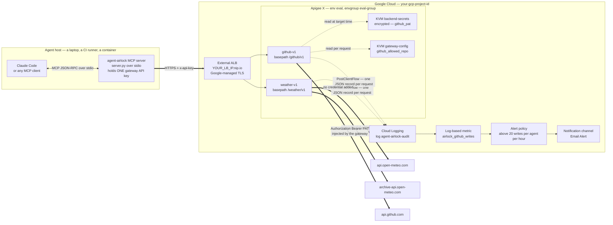
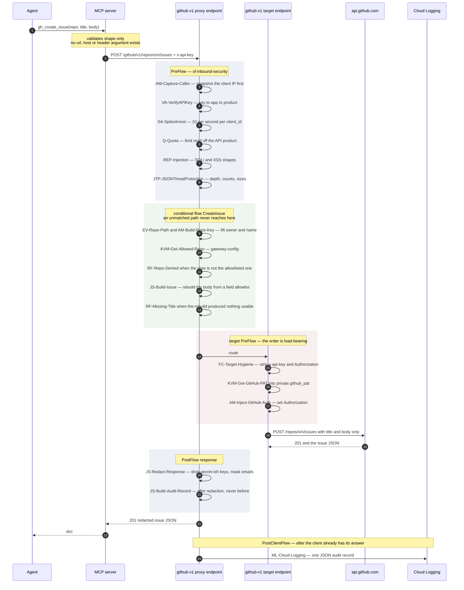
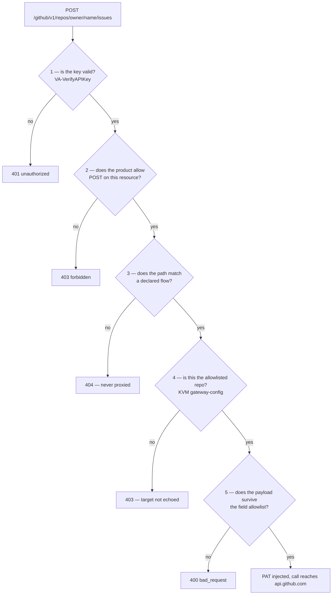

# Architecture — Agent Airlock

How an LLM agent reaches a real backend without ever holding a real credential.

The short version: the agent talks to a local MCP server, the MCP server talks to
Apigee, and only Apigee talks to GitHub. Each hop strips something away. The
agent can express far less than the MCP server can express, the MCP server can
express far less than the gateway will accept, and the gateway will accept far
less than GitHub would. That narrowing is the security property; everything
below is how it is enforced.

---

## 1. Traffic flow



The two thick arrows leaving the gateway carry different things, and the
difference is the whole design. The agent's key stops at Apigee — it is removed
from the request before any upstream call is made, and it is not a credential
anywhere else in the world. The PAT starts at Apigee — it enters the request
inside the target endpoint, microseconds before the socket opens, out of an
encrypted KVM that the agent has no path to.

---

## 2. What one request actually executes

A successful `gh_create_issue` from the operator identity, policy by policy:



Two ordering decisions there are not cosmetic.

**Hygiene runs before injection.** `FC-Target-Hygiene` removes `x-api-key`,
`apikey`, `Authorization` and `Proxy-Authorization` from the outbound request,
and only then is the PAT read and set. Swap those two steps and the gateway
deletes the header it has just written. The same ordering is what stops a caller
smuggling its own `Authorization` upstream, or shadowing the one the gateway is
about to add.

**The audit is built after redaction.** The record is assembled from a response
that has already been scrubbed, so an audit entry can never describe a body the
caller was not permitted to see. That keeps "no secrets in the logs" true by
construction instead of by hoping the redaction pass caught everything.

---

## 3. How the gateway is set up

| Component | Name | Purpose |
| --- | --- | --- |
| Ingress | External ALB at `YOUR_LB_IP.nip.io` | Managed TLS; `nip.io` supplies a resolvable hostname for a certificate without owning a domain |
| Environment | `eval`, in envgroup `eval-group` | The single Apigee X eval environment |
| Proxy | `weather-v1` — `/weather/v1` | Unauthenticated public backend; proves the policy chain with no credential in play |
| Proxy | `github-v1` — `/github/v1` | The credential-injecting proxy; the interesting one |
| Shared flow | `sf-inbound-security` | Caller capture, key verification, spike arrest, quota, injection screening, JSON threat protection |
| Shared flow | `sf-target-hygiene` | Strips client credentials before any upstream call |
| Shared flow | `sf-outbound-redaction` | `JS-Redact-Response` on every response, upstream or locally generated |
| Shared flow | `sf-fault-sanitizer` | Maps every fault to a fixed `{"error","message"}` body |
| Shared flow | `sf-audit-build` | Assembles the audit record, and recovers the identity on a scope refusal |
| Shared flow | `sf-audit-log` | The `MessageLogging` write, and nothing else |
| KVM | `backend-secrets` — encrypted | `github_pat`, the only copy of the credential |
| KVM | `gateway-config` | `github_allowed_repo`, the repository the PAT may be spent on |
| Service account | `apigee-airlock-logger@…` | Holds `roles/logging.logWriter` and nothing else |

Shared flows rather than per-proxy copies, because two bundles carrying "the
same" security chain drift apart. A third proxy inherits the identical chain in
the identical order by calling one `FlowCallout`.

### Identities

Identity is an API key bound to a developer app, bound to an API Product — and
the product is where the operation allowlist lives.

| App | Product | May call | Quota |
| --- | --- | --- | --- |
| `agent-reader` | `tools-readonly` | `GET /forecast`, `GET /repos/*/*/issues` | 100 / hour |
| `agent-operator` | `tools-operator` | the above, plus `GET /archive`, `GET`+`POST /selftest`, `POST /repos/*/*/issues` | 100 / hour |
| — | `tools-quotaprobe` | `GET /forecast` | 10 / hour |

Read and write are different identities holding different keys. An agent that
only ever needs to read runs with the reader key, and no prompt, no tool
description and no injected instruction can turn that key into one that may
POST: the refusal happens inside Apigee, before the proxy's own logic runs, on a
fact about the credential rather than about the request.

`tools-quotaprobe` exists so throttling can be demonstrated in seconds without
spending the real identities' budget.

---

## 4. How this secures MCP

MCP's exposure is specific. The transport is trusted, the client is a language
model, and tool arguments are model-generated text that can be steered by
anything the model has read — an issue body, a web page, a file it was asked to
summarize. The controls below are arranged around that.

### 4.1 The agent holds no backend credential

The MCP server's environment contains `APIGEE_HOST` and `AGENT_API_KEY`. That is
the complete list. There is no GitHub token in the process, so there is nothing
for a prompt injection, a stack trace, a debug log or a compromised dependency
to exfiltrate. What the process does hold is a key that is meaningless anywhere
except this gateway, scoped to a handful of operations, rate limited, fully
audited, and revocable in one API call without touching the PAT.

The server refuses to start if `GITHUB_TOKEN`, `GITHUB_PAT`, `GH_TOKEN`,
`HA_TOKEN`, `HOME_ASSISTANT_TOKEN` or `OPENWEATHER_API_KEY` is present. Someone
debugging a failure by exporting a token gets a crash instead of a working
bypass, which is the right trade: a bypass that works is worse than one that is
loud.

### 4.2 The agent cannot express a destination

No tool takes a `url`, a `host`, a `base_url` or a `headers` argument. The base
URL is built once at startup from a value that must be a bare hostname — a
scheme or a slash in `APIGEE_HOST` aborts the process — and every tool goes
through a single `_call()` choke point. There is no argument an agent can fill
in that redirects a request somewhere else, which removes SSRF-by-tool-argument
as a category rather than filtering for it case by case.

### 4.3 Five independent gates on the GitHub write path



They answer different questions, and none of them substitutes for another:

1. **Who is this.** The key resolves to an app, or it does not.
2. **What may this identity do.** The API Product decides verbs and resources.
   The reader cannot POST anywhere, at all.
3. **What shape of request exists.** Both proxies declare their flows and end
   with `RF-Unknown-Resource`. An undeclared path is rejected, not forwarded —
   the gateway is an allowlist of operations, not a reverse proxy that happens
   to have some rules bolted on.
4. **Where may the credential be spent.** The repository allowlist lives in a
   KVM and is compared literally against the two path segments lifted out of the
   request. The PAT may be perfectly valid for two hundred repositories; the
   gateway will spend it on exactly one. The refusal does not echo the repo the
   caller asked for, so the response cannot be used to probe what is allowed.
5. **What may the payload contain.** `JS-Build-Issue` does not sanitize the
   incoming body — it *discards* it and rebuilds one from `title` and `body`.
   `assignees`, `labels`, `milestone`, and anything GitHub invents later, cannot
   reach the API because they are never copied. An agent cannot notify, tag or
   assign a human being. A denylist of known-bad fields would need updating
   every time the upstream API grows one; rebuilding from an allowlist does not.

Gate 4 is also the fail-closed one. With `gateway-config/github_allowed_repo`
absent, `gh.allowed_repo` is null, no repository can equal null, and every
GitHub call is denied. A missing configuration closes the gateway rather than
opening it — asserted in the suite, not assumed.

### 4.4 Availability and blast radius

`SA-SpikeArrest` caps bursts at 10 per second per `client_id`. `Q-Quota` reads
its limit, interval and unit off the API Product at runtime, so changing a plan
is a product edit rather than a proxy redeploy. Both key on `client_id`, so a
looping or compromised agent throttles itself and not its neighbours — and both
run *after* `VerifyAPIKey`, because `client_id` does not exist before it.

`REP-Injection` screens the query string and the body for SQLi and XSS shapes.
`JTP-JSONThreatProtection` bounds container depth, entry counts, name lengths
and string sizes, and is skipped on GET, which carries no body.

### 4.5 Nothing chatty comes back

Every fault leaves through `sf-fault-sanitizer` and becomes a fixed
`{"error","message"}` body. Apigee's native fault text names policies, revisions
and internals; none of it reaches the caller. The classification lives in one
shared flow whose conditions are deliberately **mutually exclusive**, rather
than relying on Apigee's bottom-up first-match fault ordering — so reordering
the steps cannot change a status code.

Every response passes `JS-Redact-Response`, which drops any key matching
token / secret / password / api_key / authorization and masks email addresses to
`f***@domain`. It runs on locally generated responses too, so a fault body is
scrubbed on the same terms as a 200 from GitHub.

The observability plane is covered on the same terms. `AE-Resolve-App` returns
the whole app entity, consumer secrets included, so the environment's debug mask
hides `AccessEntity.AE-Resolve-App`; otherwise anyone able to start a trace
could read the very credentials this gateway exists to keep out of reach. The
mask is applied by `provision.sh` before the proxy that needs it is deployed,
and a static check keeps it there.

### 4.6 Every attempt is accountable

One JSON record per request, to `projects/<org>/logs/agent-airlock-audit`:

```json
{
  "ts": "2026-08-23T03:07:41Z", "agent": "agent-reader", "client_key_fp": "4ddfa347",
  "proxy": "github-v1", "revision": "3", "verb": "POST",
  "path": "/repos/owner/name/issues", "action": "github.issues.create",
  "status": 403, "outcome": "denied", "fault": "InvalidApiKeyForGivenResource",
  "latency_ms": 118, "target_latency_ms": null, "client_ip": "203.0.113.9",
  "repo": "owner/name", "detail": "the issue title, truncated to 120 chars"
}
```

- **Refusals are recorded exactly like successes.** The question an audit exists
  to answer is *what did the compromised agent try to do*, and a log of only the
  calls that worked cannot answer it. The record is built in `PostFlow/Response`
  **and** in both fault rules, because a refusal short-circuits straight past
  `PostFlow`.
- **The write cannot be skipped.** `ML-Cloud-Logging` sits in `PostClientFlow`,
  the one hook that runs unconditionally once the response has reached the
  client — so the audit costs the caller no latency, and no early exit dodges
  it. Build and write are separate shared flows because `PostClientFlow`
  executes `MessageLogging` policies **and nothing else**: a JavaScript step
  placed there is reported in a trace as having succeeded while setting no
  variables at all.
- **A scope refusal still names the agent.** Apigee raises
  `InvalidApiKeyForGivenResource` inside `VerifyAPIKey` and publishes no
  identity variable, so the single most interesting record used to land as
  `unauthenticated`. `AE-Resolve-App` looks the app up from the consumer key,
  independently of `VerifyAPIKey`, and only when nothing else has produced a
  name. It resolves the *credential*, not the authorization: `agent` says which
  key was presented, and `outcome` still says `denied`.
- **No credential is logged in usable form.** The caller's key appears only as
  an eight-character fingerprint — enough to correlate a repeated bad key across
  records, which is the shape of someone guessing, and useless to whoever reads
  the log.
- **`AM-Capture-Caller` runs first in the chain**, before the key is even
  checked, because the client address is destroyed later in the request and must
  be recorded even for a caller that never obtains an identity.

From there, a log-based metric counts issue-creation attempts per agent per
outcome — refusals included — and an alert policy fires above 20 per agent per
hour to an email channel. A prompt-injected agent retrying a denied write
against policy looks exactly like that, and it becomes visible without anything
having succeeded.

---

## 5. Threat model in one table

| Threat | What stops it |
| --- | --- |
| Injection tells the agent to exfiltrate the GitHub token | The token is in neither the agent nor the MCP server; it exists only in an encrypted KVM read inside the target endpoint |
| Injection tells the agent to call an attacker's URL | No tool accepts a URL, host or header; the base URL is fixed at startup and must be a bare hostname |
| Injection tells the agent to write to another repository | Repo allowlist in `gateway-config`, checked on both issue flows; the refusal does not echo the target |
| Reader identity is talked into performing a write | API Product scope — refused by Apigee before the proxy's own logic runs |
| Agent tags or notifies people through issue fields | The payload is rebuilt from a `title`/`body` allowlist; other fields are never copied |
| Agent probes undeclared GitHub endpoints | Declared flows plus `RF-Unknown-Resource`; nothing unmatched is proxied |
| Runaway or looping agent | SpikeArrest at 10/s and a product-managed quota, both keyed on `client_id` |
| Malicious payload aimed at the backend | `REP-Injection` and `JSONThreatProtection` on the inbound path |
| Credentials leaking back through a response | `JS-Redact-Response` on every response; the audit is built after redaction and never from a response body |
| Error messages leaking gateway internals | `sf-fault-sanitizer` — one fixed `{"error","message"}` shape |
| Secrets visible to anyone who can start a trace | PAT read into a `private.*` variable; `AccessEntity.AE-Resolve-App` added to the environment debug mask |
| The agent key is stolen | Useless off this gateway; scoped, throttled, audited, and revocable without touching the PAT |
| Missing or half-applied configuration | An absent allowlist entry denies every GitHub call; the injection policy fails the request rather than sending an unresolved template upstream |
| Quiet abuse over time | Per-request audit, log-based metric, alert policy, and the Apigee analytics views |

---

## 6. What this costs

The gap between `total_response_time` and `target_response_time` is the
airlock's own overhead: key verification, quota, screening, KVM reads,
redaction, record assembly. On this deployment it runs about **90–100 ms** per
request. The audit write is not part of that number — it happens after the
client already has its response.

See [README.md](README.md) for setup and operation, and [DEMO.md](DEMO.md) for a
runnable walkthrough of every claim on this page.
